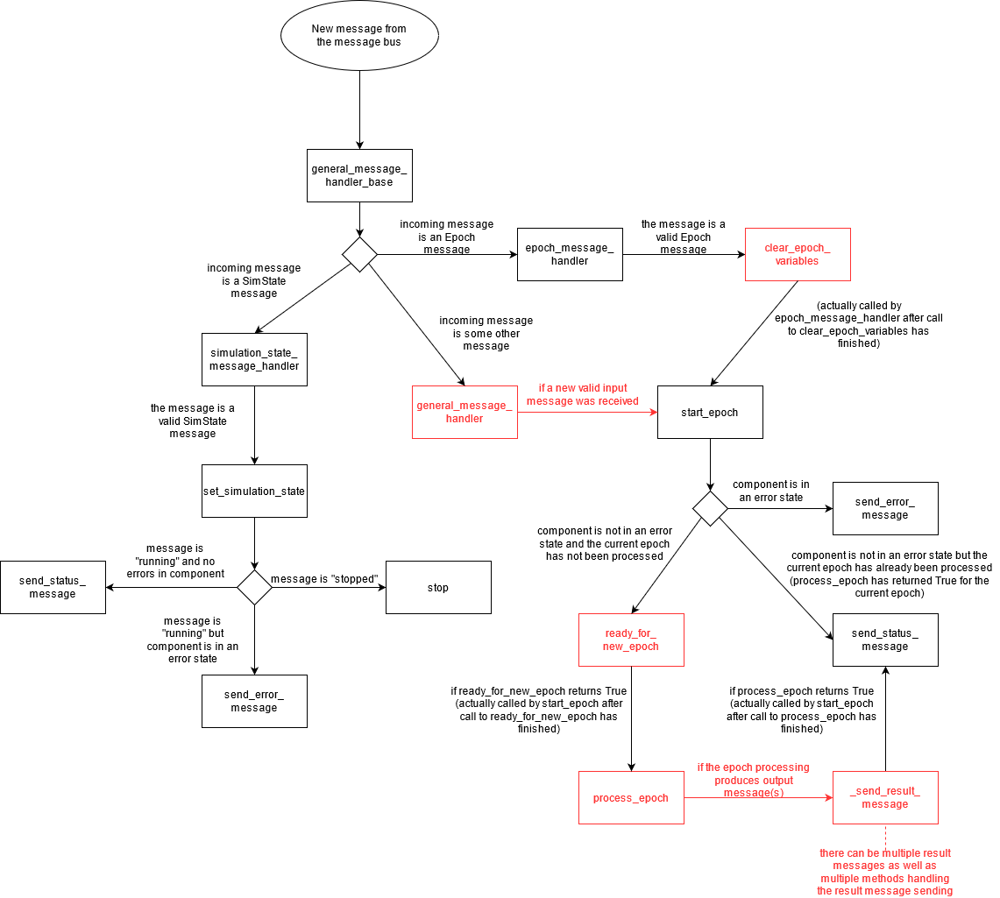

# AbstractSimulationComponent

`AbstractSimulationComponent` is a base class that contains the common functionality of simulation components. It is written in Python (3.7.9).

The source code for the class can be found at: [https://github.com/simcesplatform/simulation-tools/blob/master/tools/components.py](https://github.com/simcesplatform/simulation-tools/blob/master/tools/components.py)

New components can be developed by creating a child class from the `AbstractSimulationComponent` and providing an implementation for certain methods.

A template for creating a child class, [https://github.com/simcesplatform/simulation-tools/blob/master/examples/component_template.py](https://github.com/simcesplatform/simulation-tools/blob/master/examples/component_template.py), is available and other information regarding the creation of a new simulation component can be found at [Creating new component](core_create-cmp.md).

## The workflow during the initialization process

TODO

## The workflow when receiving a new message

A diagram describing the workflow inside the component after receiving a new message from the message bus is given below. Each box represents a method in the class.

Those methods that require an implementation in the child class are marked with red color in the diagram. These include:

- `clear_epoch_variables`
    - this method should reset all the variables that are used to store epoch specific information
- `general_message_handler`
    - any received message other than Epoch or SimState message should be handled here
    - a call to `start_epoch` is required when a new valid input message has been received
- `ready_for_new_epoch`
    - should return `true` when enough input messages have been received to be able to do something in the current epoch
- `process_epoch`
    - this should include calls to any methods that handle sending the resulting messages to the message bus
- `_send_result_message`
    - This method is included in the template as an example on how to send a message to the message bus. It should be replaced with the component specific implementation.

More information about what these methods should do is included in the component template and in the general documentation about the simulation tools package: [https://github.com/simcesplatform/simulation-tools/tree/master#general-instructions-for-creating-a-new-simulation-component](https://github.com/simcesplatform/simulation-tools/tree/master#general-instructions-for-creating-a-new-simulation-component).
