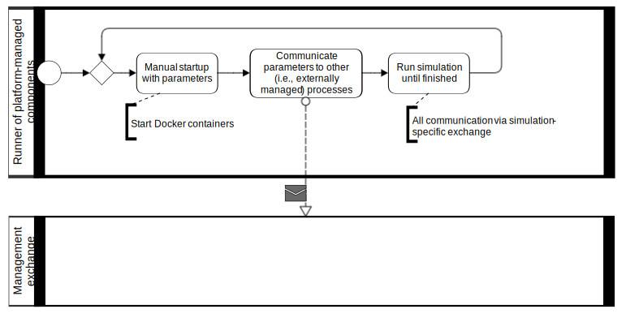

# Simulation lifecycle

This page documents the setup of components for a simulation run.

## Parametrisation

To execute, the components need certain parameters depending on the functionality. How these parameters are delivered depends on the way the components are managed (externally or in the platform).

## Types of Lifecycle

### Platform managed

In this approach, the components is managed by the platform with Docker. This suits for components that:

- Do not need a server cluster
- Do not need "a lot of" computational resources

In this approach, the following workflow repeats in a loop. Each round is started manually.

1. A user starts up components manually as Docker containers
    - In the startup, the user somehow specifies simulation parameters
2. Among the Docker containers, there is [Platform Manager](core_platformmanager.md) that communicates the simulation parameters
    - The parameters are sent to [Management Exchange](core_exchange-mgmt.md) using [Start message](core_msg-start.md)
    - This enables any externally managed components to receive the parameters
3. The components execute until finished

### Externally managed

In this approach, the component is managed manually. Human users must make sure that the component is running before a simulation can be executed. This approach has at least the following uses:

- Unit testing and first experiments
- Components that cannot reasonably be dockerized:
    - Uses a server cluster
    - Requires a lot of computational resources, such as memory
- Possibly for components that can run concurrent simulations

Each externally managed component is first started manually. Then, it runs the following workflow in a loop:

1. Receive "start" message (see [Start message](core_msg-start.md)) from [Management Exchange](core_exchange-mgmt.md); this contains simulation-run-specific parameters
2. Set up the received parameters to the component
    - After this, the component is ready to communicate with other components via the [Simulation-specific Exchange](core_exchange-sim.md)
3. Run the component; it will communicate with other components via the Simulation-specific Exchange

The workflow is illustrated in the figure below.

