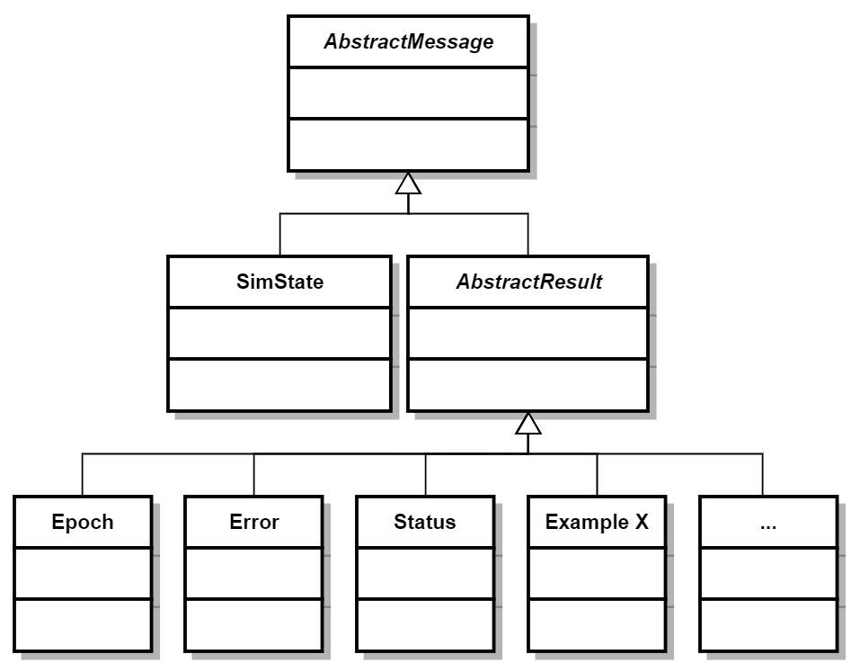

# Message structures (core)

This page gathers all message structures of the platform core.

## Type inheritance

To save the re-use of specifications and software, the message structures apply inheritance similar to object-oriented programming. This is illustrated in the following figure:

- [AbstractMessage](core_msg-abstractmessage.md) is the base class of all messages
    - All messages MUST inherit fields from this
    - The direct descendants are:
        - [SimState](core_msg-simstate.md)
        - [AbstractResult](core_msg-abstractresult.md)
- [AbstractResult](core_msg-abstractresult.md) represents the result (i.e., output) of a process
    - All messages that carry a result MUST inherit the fields of AbstractResult
    - The direct descendants are at least:
        - [Epoch](core_msg-epoch.md)
        - [Status](core_msg-status.md)
        - All actual result messages

## Re-usable blocks

Certain structures are generic and re-usable in multiple message structures. These are explained in the following table.

| Structure | Description |
|-|-|
| [Quantity array block](core_block-quantity-array.md) | Contains an array of quantity values with a unit of measure. |
| [Quantity block](core_block-quantity.md) | Contains a quantity value with a unit of measure. |
| [Time series block](core_block-time-series.md) | Contains one or more time series. |
