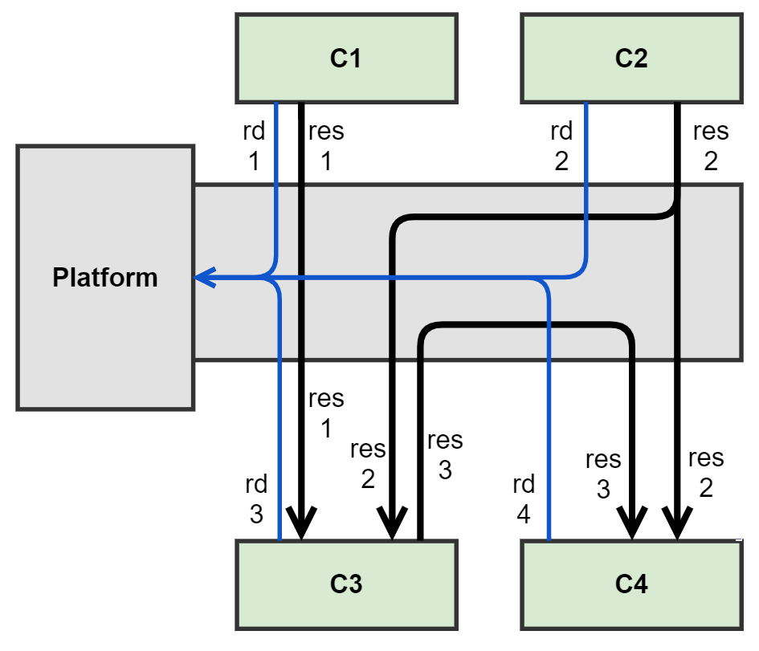

# Time and synchronization

The simulator components are distributed but should still simulate together, which necessitates a mechanism to synchronize time. This is implemented with _epochs_. An epoch represents a period of simulated time, e.g., today between 12:00 and 12:15 p.m. The length of epoch can be varied depending on the desired resolution of simulation. As epochs always represent simulated time, the duration is different in real time. This depends mainly on how fast the slowest component can simulate.

For all epochs it holds that ("Eno" is the ordinal number of the epoch):

```nohighlight
epoch.StartTime < epoch.EndTime
epoch'.Eno = epoch.Eno + 1 => epoch'.StartTime = epoch.EndTime
```

- In simulation, the first epoch has Eno = 1
- Within epoch, _epoch.StartTime_ is included, whereas _epoch.EndTime_ is excluded

To start an epoch, the platform publishes an epoch message. Once the components receive this, they have a permission to start calculating their result for the current epoch. Some components can additionally require data from other components during the epoch, which affects when the calculation can occur.

Once a component has published its result, it publishes a "ready" message to inform the platform that it has nothing more to do during the epoch. Once the platform has received a ready message from all components, the next epoch can start. This means that the simulation runs with best effort and one component is always the bottleneck.

The following figure illustrates how an epoch message is delivered to components. There are components C1-C4. As the platform publishes an epoch message, this is delivered to all components to signal what time period is to be simulated.


The following figure illustrates how components communicate their results and readiness once an epoch has started. Each component publishes a result (res1-res4) and reports it has finished by publishing a ready message (rd1-rd4). However, certain components need the result of another component to calculate their result. In the figure, C3 can only proceed once it has the result of C1 and C2, and C4 needs the result of C2 and C3, respectively. That is, some components in this example execute sequentially.



In the figures above, the messages are published as follows:

1. Platform publishes an epoch message and delivers this to C1, C2, C3 and C4
2. The following workflows occur in parallel:
    - C1
        1. Publish res1
        2. Publish rd1
    - C2
        1. Publish res2
        2. Publish rd2
    - C3
        1. Wait until res1 and res2 have been received
        2. Publish res3
        3. Publish rd3
    - C4
        1. Wait until res2 and res3 have been received
        2. Publish rd4
