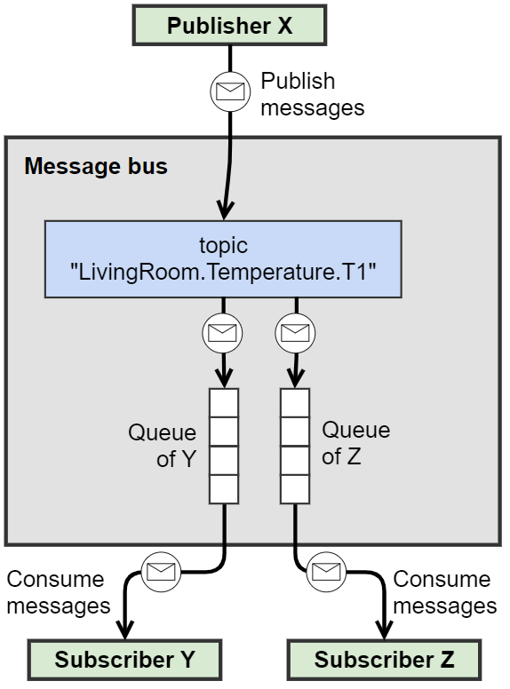

# Communication with topics, queues and exchanges

The simulation platform communicates in a publish-subscribe fashion to realize loose coupling. This means that the components do not directly request anything from each other but rather announce which information they are interested in. Then, the platform delivers this information.

Advantages:

- The sender/producer does not need to know which receivers/consumers gets the message. All interested consumers get it.
- The consumer does not need to know the sender - only the type of data.
- The consumer does not need to process the incoming immediately, the message can stay in the queue until the consumer has time to process it. This is sometimes called store-and-forward paradigm.

## Topics and queues

Publish-subscribe communication is implemented with a message bus that routes messages with topics and message queues. A topic is a string that identifies a subject of interest. Any piece of software can publish to the topic, and any piece of software can subscribe to receive messages from the topic. To receive messages, each subscriber creates a message queue and associates this to one or more topics. The motivation of queues is to enable asynchronous message processing, as the recipient can delay message reception without blocking any other node. Each topic can have an arbitrary number of subscriber queues associated. If a topic has no subscribers, no one receives message from the topic. Respectively, if there are multiple subscribers, the message bus clones each message for each subscriber.

The following figure illustrates message routing with topics and queues. The message bus manages the topics and queues. There is one topic called "LivingRoom.Temperature.T1", and subscribers Y and Z have created and associated a message queue. Whenever publisher X publishes to the topic, the message bus deliver this message to both queues. Subscribers Y and Z can receive messages from their queue when they have time. Meanwhile, any messages remain in the queue.

## Exchanges

To implement the message bus, the simulation platform uses AMQP 0-9-1 as the protocol and RabbitMQ as the product. Topic-based communication is only one communication mode in AMQP 0-9-1, but the others are irrelevant here. In addition, please note that AMQP has multiple versions that are mutually incompatible.

In AMQP 0-9-1, each topic resides in an exchange. Exchanges can realize a sandbox that isolates topics from each other. This is a useful mechanism, for example, when the intention is to run concurrent simulations in the same platform.

The platform specifies two types of exchange:

- **Simulation-specific exchange.** The platform creates one for each simulation run, as this prevents any interference between simulation runs and enables even concurrent simulations.
- **Management exchange.** There is only one of these. The management exchange is there to enable communication with components even when no simulation is running.
The details of these exchanges are explained in the pages [Simulation-specific exchange](core_exchange-sim.md) and [Management exchange](core_exchange-mgmt.md).

## Hierarchical topic names and wildcards

In AMQP 0-9-1, a topic name can be hierarchical. In this case, the hierarchy levels are separated by periods, such as "LivingRoom.Temperature.T1", "LivingRoom.Temperature.T2" and "LivingRoom.Humidity.H1" for a sensor system in a residence.

When subscribing for an AMQP topic, you can use wildcards if appropriate. These are '*' for a single hierarchy level and '#' for any number of levels. The subscription can be, for example:

- "LivingRoom.#" for all sensors in the living room
- "*.Temperature.#" for all temperature sensors in the residence

It is notable, however, that naming must be systematic to allow wildcards to work.
