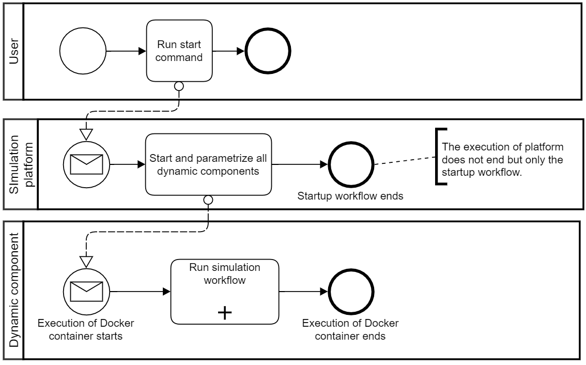
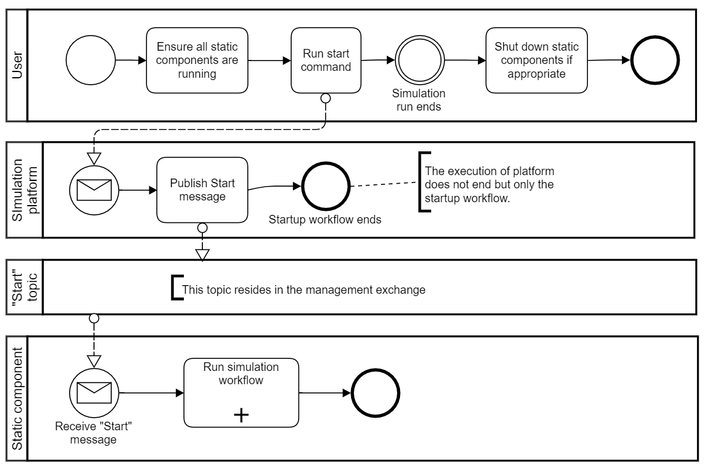

# Workflow of start and end

This page explains the workflow of starting and stopping a simulation run from the viewpoint of a simulation component.

## Overview

A simulation component can be either platform managed or externally managed, which determines the workflow of starting and ending. In a simulation run, there are always at least platform managed components, because the platform core executes in Docker and is therefore platform managed. As new components are developed, the developers decide whether to manage in the platform or externally.

## Platform managed components

The workflow of a platform managed component is as follows (see also the following figure):

1. The user runs the command to start the simulation platform.
2. The simulation platform starts.
3. The simulation platform starts all platform managed components and ships any parameters to these.
4. Each platform managed component starts as a Docker container.
5. In each platform managed component:
    - a. The component runs the simulation workflow (see [Workflow of component in simulation](core_workflow-sim.md)).
    - b. Once the simulation workflow has finished, the component ends execution (i.e., the program exits). This will end the execution of the Docker container.

## Externally managed components

The workflow of an externally managed component is as follows (see also the following figure):

1. The user ensures all externally managed components are running.
2. The user runs the command to start the simulation platform.
3. The simulation platform starts and publishes a Start message.
    - Exchange of publishing: management exchange
    - Topic of publishing: "Start"
4. In each externally managed component:
    - a. The component receives the Start message
    - b. The component runs the simulation workflow (see [Workflow of component in simulation](core_workflow-sim.md)).
5. Once the simulation has ended, the user takes care that the externally managed components shut down if appropriate.

