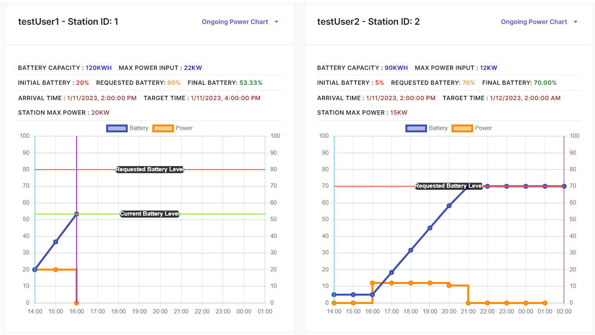
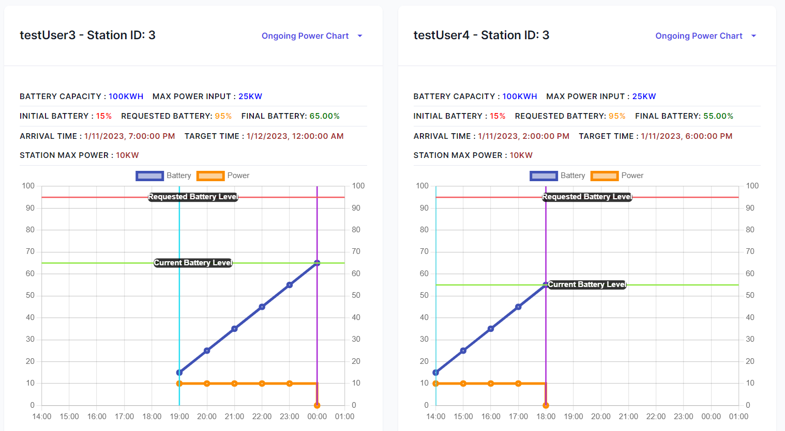

# EV charging demo scenario

## Description

The scenario describes a complete electric vehicle charging system with 3 main components of User, Station and Intelligent Controller. There are set number of users and stations at the start of the simulation where the users arrive and leave the stations after charging their electic vehicle. The users send the charging request to the IC and the IC contains the logic and algorithm to determine the power requirement for the stations.  Scenario spans over 12 hours with hourly resolution (epochs).

Scenario setup is depicted on image below. For the simplicity of the first version, the spot pricing component is absent in the simulation.

## Scenario details

The scenario has 3 stations, 4 users and 1 intelligent controller. The intelligent controller contains the total max power of the charging stations which is 30.0 KW. There are four users; user 1, user 2, user 3 and user 4. There are 3 stations; station 1, station 2, station 3. 

The simulation starts at 2023-01-11T14:00:00. User 1 arrives at station 1 and requests for a target state of charge of 80% from 20%. The target time for user 1 is 2023-01-11T16:00:00. User 2 arrives at the start of the simulation at 2023-01-11T14:00:00 at station 2 and requests for a state of charge of 70% from 5%. The target time for user 2 is 2023-01-12T02:00:00. User 3 arrives at 2023-01-11T19:00:00 at station 3 and requests for a state of charge of 95% from 15%. The target time for user 3 is 2023-01-12T00:00:00. User 4 arrives at the start of the simulation at 2023-01-11T14:00:00 at station 3 and requests for a state of charge of 95% from 15%. The target time for user 4 is 2023-01-11T18:00:00. User 4 leaves station 3 at 2023-01-11T18:00:00. Station 1, 2 and 3 have maximum power of 20 KW, 15 KW and 10 KW respectively

The intelligent controller implements a greedy algorithm and based on the algorithm prioritizes power output for the stations (earliest leaving time first, higher energy requirement second and the order the users reported in for the current epoch third). 

At the end of the simulation, the results collected are displayed in the graphs below:

## Epochs

| Epoch # | Start time       | End time         |
| ------- | ---------------- | ---------------- |
| 1       | 2023-01-11T14:00 | 2023-01-11T15:00 |
| 2       | 2023-01-11T15:00 | 2023-01-11T16:00 |
| 3       | 2023-01-11T16:00 | 2023-01-11T17:00 |
| 4       | 2023-01-11T17:00 | 2023-01-11T18:00 |
| 5       | 2023-01-11T18:00 | 2023-01-11T19:00 |
| 6       | 2023-01-11T19:00 | 2023-01-11T20:00 |
| 7       | 2023-01-11T20:00 | 2023-01-11T21:00 |
| 8       | 2023-01-11T21:00 | 2023-01-11T22:00 |
| 9       | 2023-01-11T22:00 | 2023-01-11T23:00 |
| 10      | 2023-01-11T23:00 | 2023-01-11T00:00 |
| 11      | 2023-01-12T00:00 | 2023-01-11T01:00 |
| 12      | 2023-01-11T01:00 | 2023-01-12T02:00 |

All times are given in Finnish local time (EEST).
