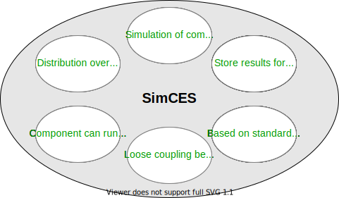

# SimCES | Simulation Environment of Complex Energy System

SimCES is a distributed simulation platform to enable the management of complex simulation scenarios.
Features in short:

- Distribute your simulation to components
- Let the components communicate over Internet
- Run the components on any platform
- Create and manage simulation configurations in one file
    - Simulate varying scenarios easily
- Retrieve simulation results from a logging interface
- Optionally, run components as containers for easier development

## Motivation

Scientific simulation systems receive benefit from a support for distribution as well as the ease of operation and management, but this combination lacks from earlier systems. Imagine a system where you can distribute the simulation task to multiple components and software platforms over a network but still manage the simulation as if you had a single piece of software. A distributed setup enables you to exploit the functionality of various platforms and combine the work of multiple simulator system developers. Besides, even real-life systems are distributed, so distribution enables you to model the world as it actually is. This increases the credibility of simulation results.

The earlier distributed simulation approaches are far from easy. Functional Mock-up Interface (FMI) is widely used but assumes you run all simulation components in one computer. Ad hoc networking has been applied, but this is laborious to deploy and maintain in large systems.

Finally, the analysis of simulation results is the ultimate aim of the system. There should be a means to access all of the simulation results, including the intermediate calculations of the simulation components.

SimCES fulfills these requirements. It does not develop any complex algorithms for you but provides a straightforward yet powerful concept for the management of simulation systems and the communication of simulation components, including the logging of simulation results.

## Source code

SimCES is open source.
Therefore, you can find the source code in Github: [https://github.com/simcesplatform](https://github.com/simcesplatform)

## This website

This website has the following main sections:

- User guide
- Developer guide
- Energy-domain-specific simulation components

You can find these in the menu.
